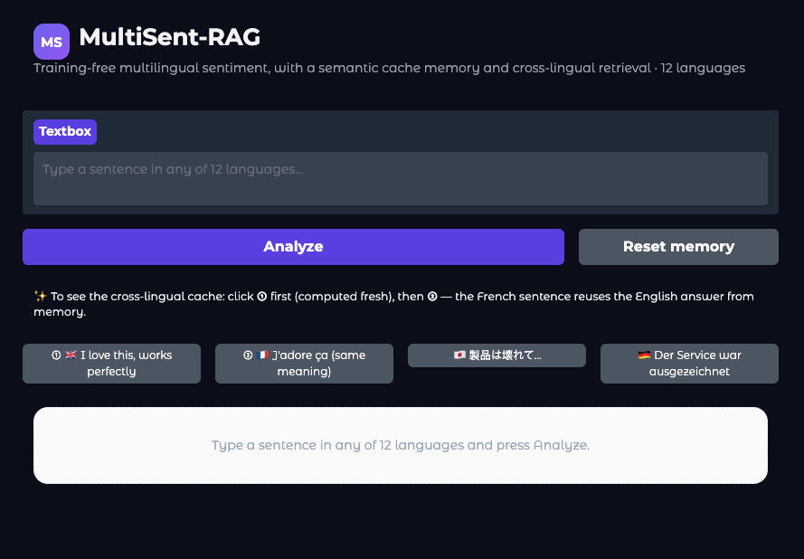
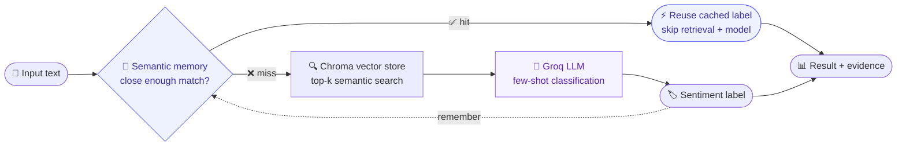

<div align="center">


# MultiSent-RAG

### Multilingual sentiment that classifies in **12 languages** — with a semantic **memory** and **cross-lingual** retrieval. No training. No GPU.

<br/>

<a href="https://huggingface.co/spaces/khouloud/multisent-rag-demo">
  
</a>
&nbsp;
<a href="https://github.com/KhouloudMN97/MultiSent-RAG">
  
</a>
&nbsp;

&nbsp;


<br/><br/>

<a href="https://huggingface.co/spaces/khouloud/multisent-rag-demo">
  
</a>

<sub><i>Type a sentence in any of 12 languages -> get the sentiment, see whether it came from <b>memory</b> or was <b>computed fresh</b>, and watch which languages the evidence was pulled from.</i></sub>

</div>

---

## ✨ Why this isn't "just RAG"

Most sentiment demos hand back a single label and hide the rest. This one **shows its reasoning** — and runs two things ordinary RAG doesn't:

- ⚡ **Semantic memory** — when a new input is close in meaning to one already seen, the system **reuses the answer and skips both retrieval and the model**. Every cache hit is shown live, with the real speed difference.
- 🌍 **Cross-lingual transfer** — a sentence in one language is classified using examples retrieved from *other* languages, in a shared multilingual space. Type Japanese, watch it reason from French and German.
- 🔍 **Fully transparent** — each result shows the **path taken** (memory vs. fresh) and the **evidence used** (which sentences, in which languages).
- 🪶 **Training-free & laptop-friendly** — no fine-tuning, and the model is served over an API, so it runs on CPU with no GPU anywhere.

> 👉 **[Open the live demo](https://huggingface.co/spaces/khouloud/multisent-rag-demo)**, click ① then ② — and watch a French input reuse an English answer straight from memory. Cross-lingual caching, in one click.

---

## ⚙️ How it works



1. **Memory first.** The input is embedded and compared to everything seen so far. A close match returns instantly — no retrieval, no model call.
2. **Retrieve on a miss.** Otherwise the most similar labeled examples are pulled from a **Chroma** vector store via semantic search.
3. **Generate.** Those examples become a few-shot prompt; the LLM classifies the sentiment.
4. **Remember.** The new prediction is stored — so the next similar input, *in any language*, becomes a fast hit.

---

## 📊 Results

Evaluated across **12 languages** (8 seen + 4 unseen / zero-shot), weighted F1:

| Model | Avg F1 · 12 languages | vs. mBERT |
|---|:---:|:---:|
| mBERT | 0.459 | — |
| **MultiSent-RAG** | **0.783** | **+0.324** |

- 🎯 **Zero-shot that actually works** — classifies *unseen* languages with no in-language examples (e.g. **Japanese 0.898**, **Bulgarian 0.771**) purely through cross-lingual retrieval.
- ⚖️ **Memory is an honest trade-off** — high reuse means big latency savings; a tighter match protects accuracy. The full breakdown of when memory *helps* vs. *hurts* lives in the complete build.

> 📦 This demo is the interactive face of a larger system. The **complete build — full pipeline, evaluation, and detailed results — lives in [the original MultiSent-RAG repo](https://github.com/KhouloudMN97/MultiSent-RAG)**.

---

## 🛠️ Built with

<p>


</p>

| Piece | Choice | Why |
|---|---|---|
| Embeddings | `paraphrase-multilingual-mpnet-base-v2` | one shared space -> cross-lingual retrieval |
| Retrieval | **Chroma** (cosine) | real semantic search over the examples |
| Memory | semantic cache | reuse prior answers, skip retrieval + model |
| Generation | **Groq API** | fast hosted inference, no local GPU |
| Interface | **Gradio** | surfaces hits, latency, and retrieved evidence |

---

## 🚀 Run it locally

```bash
# 1. Clone
git clone https://github.com/KhouloudMN97/multisent-rag-demo.git
cd multisent-rag-demo

# 2. Environment
python3 -m venv venv && source venv/bin/activate
pip install -r requirements.txt

# 3. Add a free Groq key  ->  https://console.groq.com
echo "GROQ_API_KEY=your_key_here" > .env

# 4. Launch (the vector store builds itself on first run)
python app.py
```

Open the local URL Gradio prints (usually `http://127.0.0.1:7860`).

---

## 📁 Structure

```
multisent-rag-demo/
├── app.py                  # interface: verdict · memory badge · cross-lingual panel
├── core/
│   ├── reader.py           # pipeline: memory -> Chroma retrieval -> Groq generation
│   ├── semantic_cache.py   # the semantic memory layer
│   └── build_store.py      # builds the Chroma store from examples.json
├── data/
│   └── examples.json       # owned, labeled examples across 12 languages
└── requirements.txt
```

---

## 📬 Contact

**Khouloud Mnassri** — [mnassrikhouloud.97@gmail.com](mailto:mnassrikhouloud.97@gmail.com)

- 🚀 Live demo -> https://huggingface.co/spaces/khouloud/multisent-rag-demo
- 📦 Full build -> https://github.com/KhouloudMN97/MultiSent-RAG

<div align="center">
<br/>
<sub>Designed &amp; built by Khouloud Mnassri</sub>
</div>