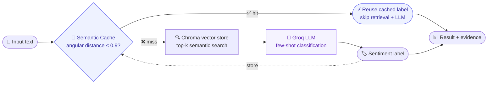

<div align="center">

# 🌍 MultiSent-RAG

### Training-free multilingual sentiment analysis — with a semantic cache memory and cross-lingual retrieval, across **12 languages**.

<br/>

<a href="https://huggingface.co/spaces/khouloud/multisent-rag-demo">
  
</a>
&nbsp;

&nbsp;

&nbsp;


<br/><br/>

<a href="https://huggingface.co/spaces/khouloud/multisent-rag-demo">
  
</a>

<sub><i>Type a sentence in any of 12 languages → get the sentiment, see whether it came from <b>memory</b> or was <b>computed fresh</b>, and watch which languages the evidence was retrieved from.</i></sub>

</div>

---

## ✨ Why this isn't "just RAG"

Most sentiment demos return a single label and hide everything else. This one **shows its reasoning** — and runs two mechanisms that ordinary RAG doesn't:

- ⚡ **Semantic cache memory** — when a new input is semantically close to one already seen, the system **reuses the prior label and skips both retrieval and the LLM**. The demo surfaces every cache hit live, with the real speed difference.
- 🌍 **Cross-lingual transfer** — a sentence in one language is classified using examples retrieved from *other* languages, in a shared multilingual embedding space. Type Japanese, watch it reason from French and German examples.
- 🧩 **Fully transparent** — every prediction shows the **path taken** (memory vs. fresh) and the **evidence used** (which sentences, in which languages).
- 🪶 **Training-free & GPU-free** — no fine-tuning; the LLM is served over an API, so the whole thing runs on a laptop with no GPU.

> 👉 **[Open the live demo](https://huggingface.co/spaces/khouloud/multisent-rag-demo)** and click ① then ② to see a French input reuse an English answer from memory — cross-lingual caching, in one click.

---

## ⚙️ How it works



1. **Cache first.** The input is embedded and compared to everything seen so far. A close match (angular distance ≤ 0.9) returns instantly — no retrieval, no model call.
2. **Retrieve on a miss.** Otherwise, the top-k most similar labeled examples are pulled from a **Chroma** vector store via semantic search.
3. **Generate.** Those examples become a few-shot prompt for the LLM, which classifies the sentiment.
4. **Remember.** The new prediction is stored, so the next similar input — *in any language* — becomes a fast cache hit.

---

## 📊 From the paper

Benchmarked across **12 languages** (8 seen + 4 zero-shot), evaluated with weighted F1:

| Model | Avg F1 (12 languages) | vs. mBERT baseline |
|---|:---:|:---:|
| mBERT | 0.459 | — |
| **MultiSent-RAG** (LLaMA-3) | **0.783** | **+0.324** |

- 🎯 **Strong zero-shot transfer** — classifies *unseen* languages with no in-language examples (e.g. **Japanese F1 0.898**, **Bulgarian 0.771**) purely through cross-lingual retrieval.
- ⚖️ **The cache is an honest trade-off** — at higher reuse rates it can reuse the large majority of inferences for a major latency drop, while a stricter threshold protects accuracy. The paper analyzes exactly when memory *reinforces* correct predictions and when it can *propagate* errors.

📄 *MultiSent-RAG: A Retrieval and Memory-Augmented System for Multilingual Sentiment Processing* — Khouloud Mnassri, Reza Farahbakhsh, Noel Crespi · *Information Processing & Management* (Elsevier).

---

## 🛠️ Tech stack

<p>


</p>

| Component | Choice | Why |
|---|---|---|
| Embeddings | `paraphrase-multilingual-mpnet-base-v2` | shared multilingual space enables cross-lingual retrieval |
| Retrieval | **Chroma** (cosine) | real semantic search over the example store |
| Memory | **Semantic cache** (angular distance) | reuse prior inferences, skip retrieval + LLM |
| Generation | **Groq API** | fast hosted inference — no local GPU needed |
| Interface | **Gradio** | surfaces cache hits, latency, and retrieved evidence |

> **Note on faithfulness:** the method matches the paper; the LLM is served via the **Groq API** instead of a locally-quantized model, which is what makes the demo run on CPU. Same architecture, deployment-friendly backend.

---

## 🚀 Run it locally

```bash
# 1. Clone
git clone https://github.com/KhouloudMN97/multisent-rag-demo.git
cd multisent-rag-demo

# 2. Environment
python3 -m venv venv && source venv/bin/activate
pip install -r requirements.txt

# 3. Add a free Groq API key  ->  https://console.groq.com
echo "GROQ_API_KEY=your_key_here" > .env

# 4. Launch (the vector store builds itself on first run)
python app.py
```

Then open the local URL Gradio prints (usually `http://127.0.0.1:7860`).

---

## 📁 Project structure

```
multisent-rag-demo/
├── app.py                  # Gradio interface (verdict · cache badge · cross-lingual panel)
├── core/
│   ├── reader.py           # pipeline: cache → Chroma retrieval → Groq generation
│   ├── semantic_cache.py   # the semantic memory layer
│   └── build_store.py      # builds the Chroma vector store from examples.json
├── data/
│   └── examples.json       # owned, labeled examples across 12 languages
└── requirements.txt
```

---

## 🔗 Links

- 🚀 **Live demo:** https://huggingface.co/spaces/khouloud/multisent-rag-demo
- 🔬 **Research code:** https://github.com/KhouloudMN97/MultiSent-RAG
- 📄 **Paper:** *Information Processing & Management* (Elsevier)

---

<div align="center">
<sub>Built by <b>Khouloud Mnassri</b> · Télécom SudParis, Institut Polytechnique de Paris</sub>
</div>